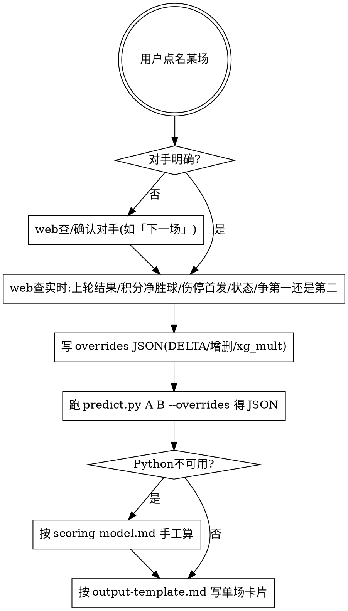

# 世界杯比分预测(单场高精度)

针对**用户点名的某一场对阵**,基于内置 48 强球队画像 + 评分模型,先 web 查实时(上轮
结果/伤停/首发/状态/赛况),再用**高精度对位引擎**(边路速度、一对一盘带、反击打身后、
空中/定位球——后防与对位直接修正 xG)算出比分、胜平负、置信度、进球线索。

## 何时使用

- 用户点名两队(如「预测阿根廷对法国」「巴西下一场」)→ **唯一模式:单场高精度**
- 用户问某场比分 / 胜负 / 谁进球 / 置信度
- 不做「未来 24 小时多场」批量预测;如用户只说「下一场」,先确认/查出对手是谁,再单场预测。

## 球队数据库(48 队 / 12 组全覆盖)

真实 2026 世界杯为 **48 队 / 12 组**(美·加·墨主办,小组赛多为中性场)。本库**已覆盖全部
48 支球队**,每队一个 YAML:`references/teams/<name>.yaml`。代码与真实分组:

| 组 | 球队 | 球队 | 球队 | 球队 |
|----|------|------|------|------|
| A | MEX 墨西哥 | KOR 韩国 | CZE 捷克 | RSA 南非 |
| B | CAN 加拿大 | SUI 瑞士 | QAT 卡塔尔 | BIH 波斯尼亚 |
| C | BRA 巴西 | MAR 摩洛哥 | SCO 苏格兰 | HAI 海地 |
| D | USA 美国 | TUR 土耳其 | PAR 巴拉圭 | AUS 澳大利亚 |
| E | GER 德国 | ECU 厄瓜多尔 | CIV 科特迪瓦 | CUW 库拉索 |
| F | NED 荷兰 | JPN 日本 | SWE 瑞典 | TUN 突尼斯 |
| G | BEL 比利时 | IRN 伊朗 | EGY 埃及 | NZL 新西兰 |
| H | ESP 西班牙 | URU 乌拉圭 | KSA 沙特阿拉伯 | CPV 佛得角 |
| I | FRA 法国 | SEN 塞内加尔 | NOR 挪威 | IRQ 伊拉克 |
| J | ARG 阿根廷 | ALG 阿尔及利亚 | AUT 奥地利 | JOR 约旦 |
| K | POR 葡萄牙 | COL 哥伦比亚 | COD 刚果(金) | UZB 乌兹别克斯坦 |
| L | ENG 英格兰 | CRO 克罗地亚 | GHA 加纳 | PAN 巴拿马 |

48 队已全部就位,正常对阵均可直接预测。若个别球队后续需要更新,按相同格式修改对应
`references/teams/<name>.yaml` 即可。**评分(ratings 0-100)与球员属性为主观估计,非官方数据。**

> **基准 vs 实时(核心原则)**:`teams/*.yaml` 是球队的**整体/满状态画像**(稳定的总体
> 实力),**不写时点信息**。近期状态、伤停、停赛、临场换人等**实时信息在跑预测时叠加**
> (见下「实时校正层」),基准 YAML 永不为某一场而改动——否则会过期、且污染其它比赛。

## 实时校正层(运行时叠加,不改基准)

**跑具体某场/某比赛日前,先用 fetch/web 查实时**(上一轮真实结果、伤停名单、近期状态),
写成一个 overrides JSON,用 `--overrides` 在运行时叠加。基准 YAML 不动。

```bash
python3 scripts/predict.py FRA SEN --overrides /tmp/realtime.json --human
python3 scripts/predict.py NED SWE --overrides /tmp/realtime.json
```

overrides 格式见 `references/overrides.example.json`。每队(按 code)可填:

| 字段 | 含义 |
|------|------|
| `note` | 这次为什么调(伤停/状态),会显示在报告里 |
| `ratings` | **相对基准的增减(DELTA)**,如 `{"defense": -7, "form": +7}`,不是绝对值 |
| `drop_players` | 移除的核心球员(伤/停/未进名单),按 `name` |
| `add_players` | 顶替进来的球员(同 core_players 结构) |
| `xg_mult` | **动机/策略乘子**(默认 1.0)。必胜刷净胜球→1.05~1.15;已出线大轮换/保平→0.85~0.95 |

工作流:**先 web 查赛况(上轮结果/积分净胜球/伤停复出时间线/争第一还是第二)→ 译成
DELTA·增删·xg_mult → `--overrides` 应用 → 报告里写「赛况与策略」+ 声明校正了什么**。
没有实时输入时,不加 `--overrides` 即纯基准画像;两者都能跑。

> **算得深(不止比分)**:合格报告必须回答——关键伤员本场能否复出?首轮平/小胜后本场
> **净胜球**是否重要?该队想要小组**第一还是第二**(对应不同淘汰赛半区)?用 `xg_mult`
> 落到数字 + 在「赛况与策略」段落讲清楚。

## 工作流



## 运行 predict.py(单场高精度)

```bash
# 单场(世界杯=中性场,默认不加主场);对位分析默认开启并已修正 xG
python3 scripts/predict.py FRA SEN
python3 scripts/predict.py FRA SEN --human                 # 可读单场卡片(含对位拆解)
python3 scripts/predict.py MEX KOR --home MEX              # 东道主在本国享主场加成

# 叠加实时校正(伤停/状态/上轮结果/动机),基准 YAML 不动
python3 scripts/predict.py BRA HAI --overrides /tmp/rt.json --human
```

- 输入恰好两个球队代码;默认输出 JSON,加 `--human` 输出可读单场卡片。
- **中性场**:世界杯小组赛默认中性,不加主场加成;仅东道主(美/加/墨)在本国 `--home <code>`
  才享 ×1.10。
- **`--overrides <json>`**:运行时叠加实时校正(见「实时校正层」),基准 YAML 不变。
- JSON 含:`xg`、`xg_breakdown`(基线×动机×对位=最终)、`matchup`(逐维对位:边路速度/
  一对一/反击打身后/空中定位球,各含 edge 与 xG 效应)、`defense`(各队最吃哪条线/被对手
  对位×多少/哪条守得住)、`predicted_score`、`most_likely_result`、`modal_scoreline`、
  `top_scorelines`、`result_probability`、`confidence`、`neutral`、`adjustments`、
  `likely_scorers`、`comparison`。

## 输出报告

**必须**按 `references/output-template.md` 写中文报告。规则:

- **第一次就给完整深版,不许先简后深**:首条回答即包含「预测结果 + 对位拆解 + 防守端 +
  赛况与策略 + 进球剧本」全部段落。不要先甩一个"法国 2-1、看好法国"的简版,等用户追问
  "结合防守和对位了吗"才展开——那是失败。深度是默认,不是补充。
- **数字必须来自 predict.py,严禁凭感觉**:胜平负%/xG/比分/置信度全部跑脚本得到再抄。
  禁止手写"法国胜 58%、信心中等偏高"这种没有脚本支撑的数字(口径会和模型打架)。
- **头条比分用 `predicted_score`**(最可能结果对应比分),不用 `modal_scoreline`(常 1-1)当结论。
- **三线与阵容(默认必写)**:用 `comparison.lines` 写**前场/中场/后场/速度**三线对比(双方数值+谁占优),
  用 `comparison.squad` 写**核心平均年龄、年龄结构、经验、状态**。这几项是用户点名要的,绝不能省。
- **对位拆解(默认重点)**:用 `matchup` 逐维 + `xg_breakdown` 写——边路速度/一对一/反击打
  身后/空中定位球,各把 xG 抬高/压低多少。不能只写"整体强"。
- **防守端(默认必写)**:用 `defense` 字段——每队"最吃哪条线、被对手对位×多少、哪条守得住"。
  这正是用户最想要的"结合防守"。
- 关键分析:后防失误概率、中场强度、经验年龄平衡、核心站位对防线影响、对位结论
  (数据来自 `comparison` + `matchup` + `defense`)。
- 「赛况与策略」必写:伤员复出时间线、净胜球意义、争第一还是第二、动机(如用了 `xg_mult`)。
- 进球剧本:从 `likely_scorers` 取 xG 份额最高者,用其 `scoring_styles` 写「怎么进」。
- **结尾必须主动推荐出图(不可省)**:报告的**最后一节固定是「想要对决图?」**(见
  output-template.md 模板内的同名节),主动问用户要不要出一张巨星对决图,并给本场图方向
  + 命令 `python3 scripts/card.py <A> <B> --stage "..."`。这是模板的一部分,照模板写就必带;
  绝不能因为它"像附注"而漏掉。
- 模型与降级算法见 `references/scoring-model.md`。

## 巨星对决图(预测后默认主动推荐)

本 skill **只产出生图 prompt,不渲染图片**——渲染由运行本 skill 的客户端(其接入的生图
模型)负责。预测完成后,**主动推荐出一张「巨星对决图」**,用 `scripts/card.py` 生成
prompt,把它作为客户端生图模型的输入。

```bash
python3 scripts/card.py FRA SEN --stage "I组·小组赛"
python3 scripts/card.py BRA HAI --overrides rt.json --stage "C组·第2轮"   # 叠加实时
```

输出:英文 prompt(推荐)+ 中文 prompt + negative + 配套发帖文案。要点:

- **双星** = 每队 `likely_scorers[0]`(xG 份额最高者);**比分/胜平负** 全来自 predict.py。
- **用真实球星本人**:EN prompt 用球星罗马字真名(如 Kylian Mbappé / Sadio Mané)+「真实球星、
  写实还原、面部高度还原」措辞——客户端的强生图模型据此还原本人,不要回避真人肖像。
  中文名→罗马字名映射在 `card.py` 的 `STAR_EN`;新球星可往里补。
- prompt 描述「左右分屏巨星对决 + 中央 VS + 夜场光效 + 底部大比分横幅」,竖版 3:4。
- 客户端生图模型若支持文字(nano-banana / Gemini 类)可直接渲染比分;否则比分作为叠加层。
- 回答里**直接把 prompt 给出**(客户端可据此出图),并说明可换中文版 / 改风格(配色、横版头图等)。

## 降级:Python 不可用

按 `references/scoring-model.md` 手工推算 xG / 泊松比分 / 置信度,再写报告。数字会粗一些,
但流程一致。务必声明是手工估算。

## 常见错误

- **报告结尾漏掉「想要对决图?」推荐 → 失败**。它是模板最后一节(必带),不是可选附注;
  写完一句话总结后必须接上出图推荐 + 本场图方向。
- **第一次只给简版、等用户追问"结合防守和对位了吗"才展开 → 失败**。首条回答就要带对位
  拆解 + 防守端 + 赛况策略,深度是默认。
- **凭感觉手写胜率(如"法国胜 58%、信心中等偏高")→ 禁止**。所有数字必须跑 predict.py 得到;
  手写数字会和模型口径打架(模型这场可能是 52%、低置信度)。
- **把时点信息(伤停/某场状态/上轮结果)焊进 `teams/*.yaml` → 错**。基准是整体画像,
  实时用 `--overrides` 运行时叠加;否则基准会过期并污染其它比赛。
- 跑实时预测却不先 web 查最新结果/伤停 → 不达标。具体某场必须先校正再预测。
- 用 `modal_scoreline`(联合众数,常 1-1)当头条 → 错。头条用 `predicted_score`,与胜平负一致。
- 只给数字不给对位/防守/进球剧本 → 不达标。用户要的是「谁进球怎么进 + 后防与对位吃亏分析」。
- 给中性场加主场加成 → 错。世界杯小组赛默认中性,仅东道主在本国例外。
- 做「未来 24 小时」批量预测 → 已废弃。只做单场。
